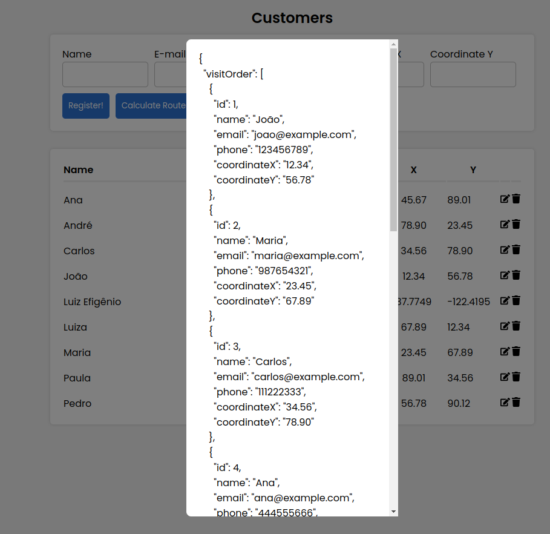
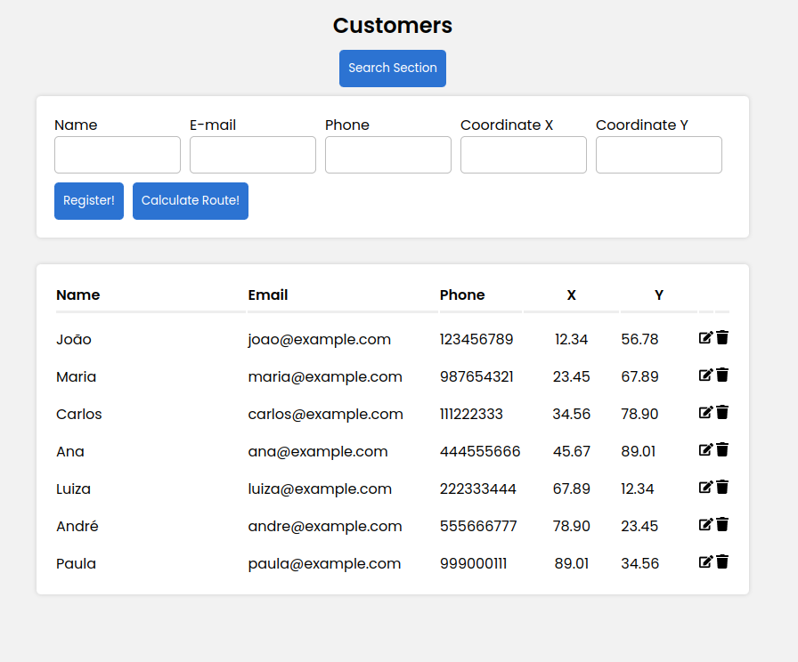
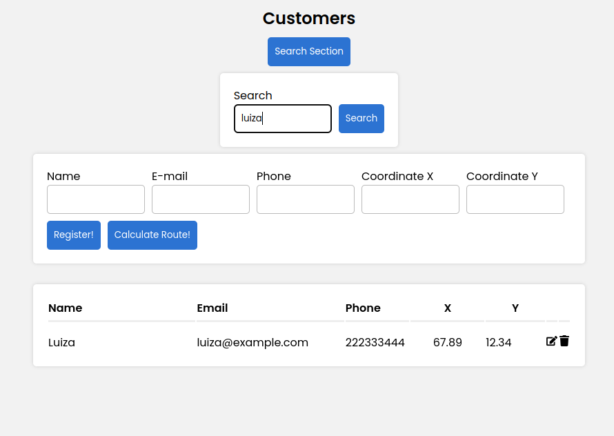

## 🚀 Instalando Facilita Challenge

Certifique-se de ter o Docker instalado em sua máquina. Você pode encontrar instruções de instalação em https://www.docker.com/get-started.

> Inicie os Contêineres:
> Use o Docker Compose para iniciar os contêineres necessários para o projeto. Execute o seguinte comando na raiz do seu projeto

Isso iniciará os serviços (frontend, backend, banco de dados) em contêineres isolados.

```
docker-compose build && docker-compose up
```

> O frontend rodará no endereço http://localhost:3000/
> Comandos Úteis do Docker:

```
docker-compose up -d  #Inicia os contêineres em segundo plano.
docker-compose down   # Para e remove os contêineres.
docker ps             #Lista os contêineres em execução.
```

Para mais informações sobre o Docker, consulte a documentação oficial em https://docs.docker.com/.

### DDL da tabela do banco de dados

Após subir a aplicação usando docker não esquecer de criar/popular o banco de dados

> Rodar todos DDL./backend/migrations/

# Facilita Challenge API Documentation

Está documentação disponibiliza detalhes sobre Facilita Challenge API

### Create Customer

- **Method:** POST
- **URL:** `http://localhost:5000/api/customer`
- **Request Body:**
  ```json
  {
    "name": "maria",
    "email": "maria@email.com",
    "phone": "91771111",
    "coordinateX": "34.56",
    "coordinateY": "78.90"
  }
  ```

### Get All Customers

- **Method:** GET
- **URL:** `http://localhost:5000/api/customer`

### Get Customer by ID

- **Method:** POST
- **URL:** `http://localhost:5000/api/customer/{id_do_cliente}`

### Delete Customer

- **Method:** DELETE
- **URL:** `http://localhost:5000/api/customer/{id_do_cliente}`

### Update Customer

- **Method:** PUT
- **URL:** `http://localhost:5000/api/customer/{id_do_cliente}`
- **Request Body:**
  ```json
  {
    "name": "maria",
    "email": "maria@email.com",
    "phone": "91771111",
    "coordinateX": "34.56",
    "coordinateY": "78.90"
  }
  ```

### Calculate Routes

- **Method:** GET
- **URL:** `http://localhost:5000/api/routes/calculate}`

### Search by Info Customer

- **Method:** GET
- **URL:** `http://localhost:5000/api/customer/search?searchTerm=pedro`

## ☕ Usando Facilita Challenge

Basicamente é um CRUD de clientes, mas o grande foco dessa aplicação é resolver esse desafio proposto pela a Facilita

> O objetivo é calcular a rota partindo da empresa (0,0) e que passe pela localização de todos os clientes cadastrados no banco de dados e retorne à empresa no final. A rota deve ser calculada para ter a menor distância possível.

> OBS: não podia usar ORM então utilizei o pattern Repository

Eu usei a técnica de brute force para percorrer todas as rotas e ir ordenando pela order de mais perto (0,0)




